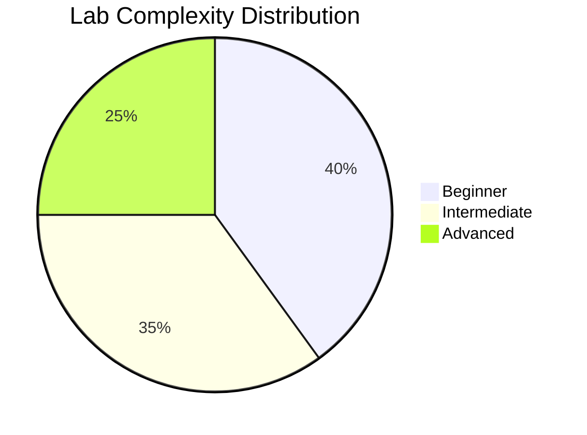
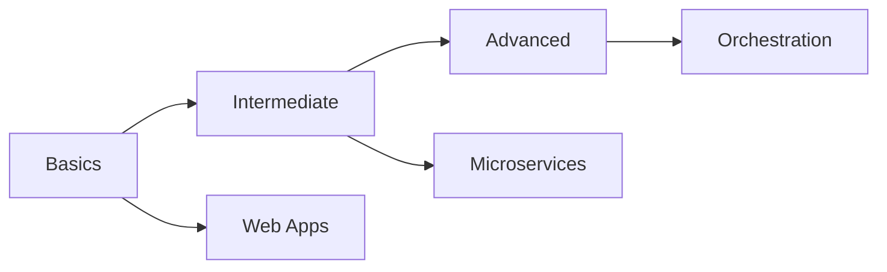
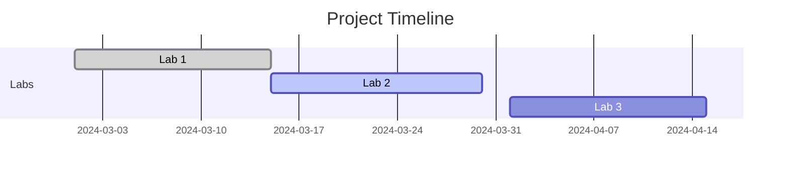

# 🐳 Docker Learning Labs

🚀 A comprehensive collection of Docker labs and examples for learning container technology from basics to advanced concepts.

[Getting Started](#getting-started) •
[Labs Overview](#labs-overview) •
[Contributing](#contributing) •
[Support](#support)

## 📊 Project Statistics

## 🎯 Key Features

- 📚 Step-by-step tutorials
- 🛠️ Hands-on examples
- 🔄 Real-world scenarios
- 📝 Detailed documentation
- 🤝 Community-driven content

## 🗺️ Labs Overview

### Lab 1: Docker Basics
- 📦 Basic Dockerfile creation
- 🏷️ Working with labels
- 🔄 Image building fundamentals

### Lab 2: Web Application Deployment
- 🌐 Multi-page website deployment
- 🎨 Modern UI/UX implementation
- 🔒 Security best practices

## 🚀 Getting Started

\`\`\`bash
# Clone the repository
git clone https://github.com/secopsarch/dockerlabs.git

# Navigate to specific lab
cd dockerlabs/lab1  # or lab2

# Build and run containers
docker build -t myapp:1.0 .
docker run -d -p 8080:80 myapp:1.0
\`\`\`

## 📈 Learning Path

## 💡 Prerequisites

- Docker Engine 20.10+
- Basic command line knowledge
- Text editor of your choice
- Git (optional)

## 🤝 Contributing

We love contributions! Here's how you can help:

1. 🍴 Fork the repository
2. 🌿 Create a feature branch
3. 💻 Make your changes
4. 🔄 Submit a pull request

## 📊 Project Growth

## 🌟 Success Stories

> "This Docker labs project helped me understand containerization from ground up!" - DevOps Engineer

> "The best hands-on Docker learning resource I've found." - Software Developer

## 📫 Support

- 📧 Email: support@dockerlabs.com
- 💬 Discord: [Join our community](https://discord.gg/dockerlabs)
- 🐦 Twitter: [@dockerlabs](https://twitter.com/dockerlabs)

## 📈 Repository Activity

## 🌐 Tech Stack

## 📝 License

This project is licensed under the MIT License - see the [LICENSE](LICENSE) file for details.

---

Made with ❤️ by the Docker Labs Community

 
